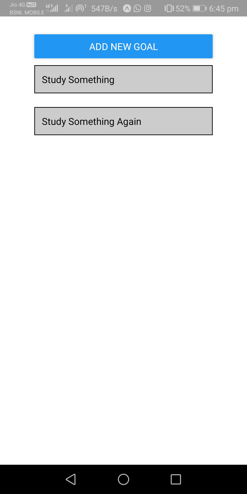

# To-Do List App

This app is developed in react native using expo cli for practice purpose.

## Setup

### 1. Install required packages

```
$ npm install
```

### 2. Start the application

```
$ npm run start
```

### Below are some of the screenshots of app:

 &nbsp;&nbsp;&nbsp;&nbsp;  &nbsp;&nbsp;&nbsp;&nbsp; 


